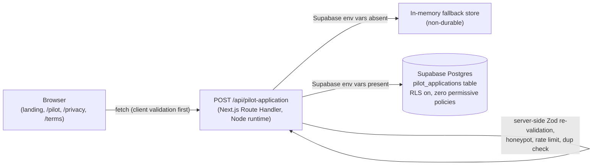

# Skumetra — Architecture

**Owner:** Andrey Grubin · **Status:** Active · **Last verified:** 2026-08-05
**Verified against commit:** `31091a7` on `main`

## 1. Current, verified architecture

A single Next.js 16 (App Router) application, deployed to Vercel as a
normal server-capable app — **not** a static export. Client and server code
live in the same repository and deploy together.

- **Client boundary:** React components under `src/components/`, React Hook
  Form + Zod for the pilot form. No secrets, no direct database access.
- **Server boundary:** `src/app/api/pilot-application/route.ts` — the only
  code path that touches Supabase. Uses the `service_role`-equivalent
  secret key, constructed only in `src/lib/supabase/server-client.ts`
  (server-only, never imported from a `'use client'` file).
- **Persistence boundary:** one table, `pilot_applications`, RLS enabled
  with **no** permissive policies for `anon`/`authenticated` — only the
  server-side secret key (which bypasses RLS, and has explicit table-level
  `GRANT`s — see `TESTING_AND_SECURITY.md`) can read or write it.
- **Fallback boundary:** `src/lib/services/pilot-application-fallback-store.ts`
  — an in-memory store used automatically when Supabase env vars are
  absent, so tests and local dev need zero real credentials. Not durable
  across restarts/cold starts — production always has Supabase configured.
- **Security boundary at the route:** raw body size cap (10KB), per-IP
  rate limiting (in-memory, non-durable across serverless cold starts —
  see `TESTING_AND_SECURITY.md`), honeypot field (fake-success response,
  not an error, when triggered), durable per-email duplicate check.
- **Monitoring boundary (prepared, not active):**
  `src/lib/monitoring/error-reporting.ts` (Sentry-shaped, logs to console
  until a DSN is set) and `src/lib/monitoring/analytics.ts` (PostHog-shaped,
  no-ops until a key is set).

## 2. Intended MVP architecture (planned, not built)

Beyond Release 1, the plan (per `PRODUCT_BASELINE.md` and
`../../Skumetra_MVP_Technology_Selection.md`) is:

- **Auth boundary:** Supabase Auth, not yet added.
- **Data boundary:** a general-purpose Supabase schema (products, supplier
  data, matches, analysis results, alerts) — today only the narrow
  `pilot_applications` table exists.
- **File-upload path:** private Supabase Storage buckets for Amazon/supplier
  files — not yet added.
- **Processing path:** server-side CSV/Excel parsing → column mapping →
  product matching (exact, then AI-assisted) → deterministic financial
  calculation → alert generation. None of this exists yet; the
  `src/components/product/*` components are static illustrative previews
  only.
- **Deterministic-calculation boundary:** financial values (minimum safe
  price, margin) must be computed by ordinary deterministic code, never by
  an AI model. Not yet implemented, so this boundary is a requirement, not
  yet an enforced one.
- **AI-assistance boundary:** AI may assist mapping/matching/explanation;
  it may not compute final financial values, decide prices, approve
  uncertain matches, override rules, or act on the seller's behalf. Not
  yet implemented.

## 3. Deferred architecture

Stripe billing/webhooks, background job infrastructure, email delivery,
Amazon SP-API integration, multi-marketplace support, admin dashboards.
None of these have any code or configuration in this repository. See
`RELEASE_PLAN.md` for which release each belongs to.

## Why this matters for future work

Nothing built so far should make Releases 2–4 harder to build. Route
Handlers, Server Actions, server-side validation, and a server-only
Supabase client are all already in place and working — extending them
(more tables, Auth, Storage) is additive, not a rearchitecture.
